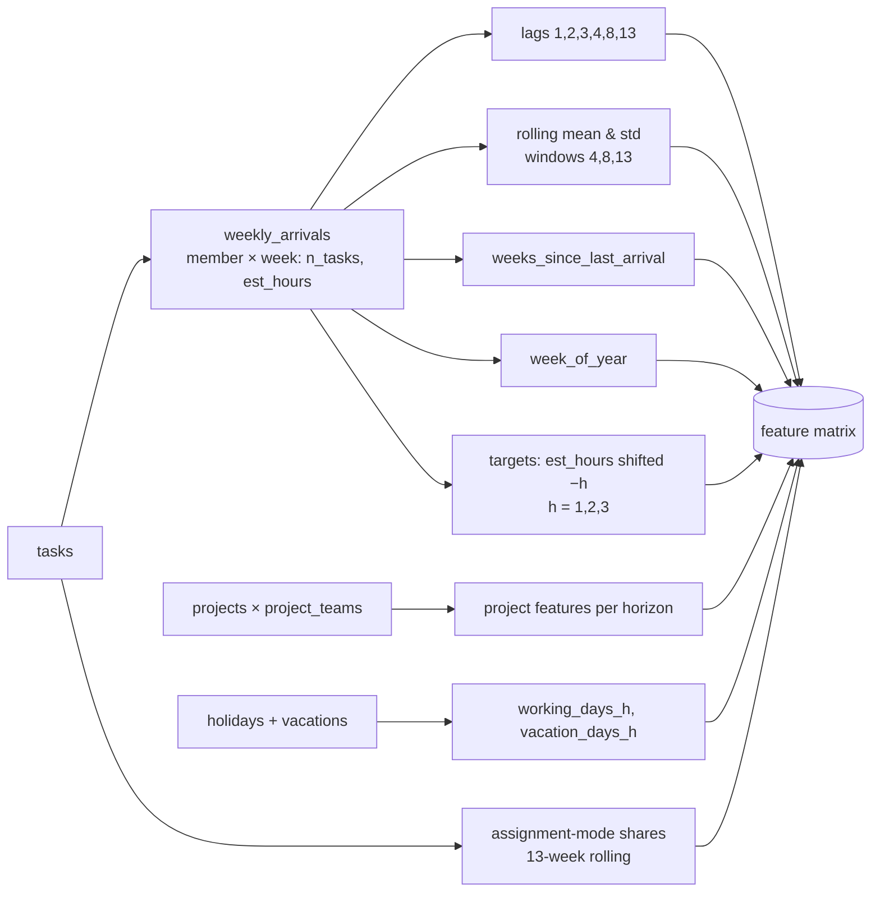
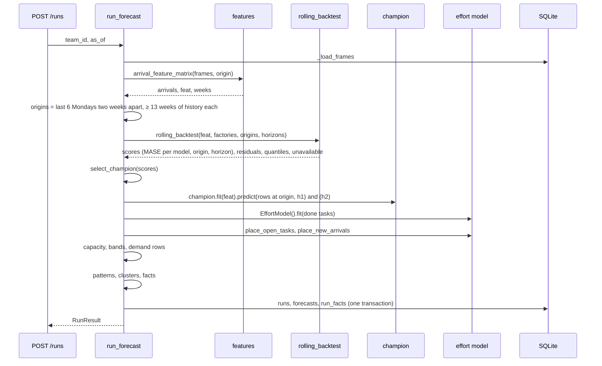

# Forecasting internals: the feature matrix, the four arrival models, and the backtest tournament

> Superseded on 2026-09-10: the Python service and desktop app this document describes are archived on branch `archive/python-desktop-v1`. The current design is `docs/superpowers/specs/2026-09-09-java-forecast-module-design.md`.

Date: 2026-09-07. Describes the code on `dev` at commit `f169361`. Every constant, column and formula
below is taken from the source named beside it; when the code changes, this document is wrong until
it is updated. Companion documents: the approved design
(`docs/superpowers/specs/2026-09-03-workload-forecast-design.md`), the evaluation design
(`docs/superpowers/specs/2026-09-06-forecast-evaluation-and-chronos2-design.md`), and the planned-work
design that will change parts 1 and 3 once the real export has landed
(`docs/superpowers/specs/2026-09-07-planned-work-and-likely-work-design.md`).

Vocabulary used throughout: an **arrival** is a task being assigned to a member; the **arrival
series** is the estimated hours of arrivals per member per week; an **origin** is a Monday from which
the models look forward; a **horizon** `h` is a number of weeks after the origin; **demand** is the
hours of work a member will have to do in a forecast week; **capacity** is the hours they have.

---

## Part 1. From the database to the feature matrix

### 1.1 Inputs

`run_forecast` (`service/src/whf/pipeline.py`) loads eight frames from SQLite through `_load_frames`,
parsing the date columns into `datetime.date`:

| Frame | Columns used downstream |
|---|---|
| `tasks` | `id`, `assignee_id`, `team_id`, `project_id`, `type`, `priority`, `status`, `created_at`, `assigned_at`, `due_date`, `completed_at`, `estimated_hours`, `actual_hours`, `assignment_mode` |
| `members` | `id`, `team_id`, `counted_in_workload`, `role` |
| `teams`, `projects`, `project_teams` | project `start_date`, `deadline`, `type`; which projects touch which team |
| `holidays` | `date` (Morocco public holidays, from the `holidays` package) |
| `vacations` | `member_id`, `start_date`, `end_date` |
| `capacity_overrides`, `capacity_defaults` | permanent or per-week weekly hours; the default is 44 h |

Only members with `counted_in_workload = 1` enter the arrival series. A skill team leader never does;
a team leader does, like any member.

### 1.2 Time frame of a run

Given the run date `as_of` (`service/src/whf/calendar.py`):

- weeks start on Monday; `week_start(d)` is the Monday of `d`'s week;
- `origin = last_complete_week(as_of) = week_start(as_of) - 1 week`, the last Monday whose week is
  fully in the past;
- the two forecast weeks are `f1 = week_start(as_of)` when `as_of` is a Monday, otherwise the next
  Monday, and `f2 = f1 + 1 week`;
- the horizons are `h1 = (f1 - origin) / 7` weeks and `h2 = h1 + 1`. On a Wednesday run this is
  `(2, 3)`: the current partial week is not modelled, which the facts state under `limitations`.

### 1.3 The arrival series

`weekly_arrivals(tasks, member_ids, weeks)` (`service/src/whf/features.py`) groups every task by
`(assignee_id, week_start(assigned_at))` and sums two things per cell: `n_tasks`, the count, and
`est_hours`, the sum of `estimated_hours`. The grid is the full product of counted members and all
Mondays from the first assignment in the database to the origin, so a week with no assignment is an
explicit `0.0`, not a missing row. That matters because most members have many empty weeks and the
models must learn the zeros.

`est_hours` is the only target. Task counts are computed but never forecast. (The planned-work design
adds a `fresh_hours` column beside it and makes that the target; see its section 5.4.)

### 1.4 The feature matrix

`build_feature_matrix` adds columns to every `(member, week)` row. All are computed per member, in
week order, and only from that row's week and earlier, so there is no leakage from the future into a
feature.



Column by column (`LAGS = (1, 2, 3, 4, 8, 13)`, `ROLL_WINDOWS = (4, 8, 13)`, `HORIZONS = (1, 2, 3)`):

| Column | Definition |
|---|---|
| `lag{k}` | `est_hours` shifted by `k - 1` weeks: `lag1` is the row's own week, `lag2` the week before, up to `lag13`. NaN when the member's history is shorter. |
| `roll_mean_{w}`, `roll_std_{w}` | rolling mean and standard deviation of `est_hours` over the last `w` weeks including the row's week (`min_periods` 1 for the mean, 2 for the std, missing std filled with 0). |
| `weeks_since_last_arrival` | weeks since the last non-zero week, forward-filled; 52 when there has been none. |
| `week_of_year` | ISO week number as a float, the only calendar seasonality feature. |
| `member_id`, `team_id` | categorical. |
| `share_manual`, `share_self_picked`, `share_project` | the member's shares of assignment modes over a 13-week rolling window (`STYLE_WINDOW = 13`), from `assignment_mode`. |
| `proj_active_h{h}`, `proj_min_weeks_to_deadline_h{h}`, `proj_max_weeks_since_start_h{h}`, `proj_starting_h{h}`, `proj_ending_h{h}` | for the **target** week `row week + h`, over the member's team's projects: how many are active, the nearest deadline in weeks (52 if none), the longest elapsed time since a start, how many start and how many end inside that week. |
| `working_days_h{h}`, `vacation_days_h{h}` | for the target week: working days minus holidays, and of those how many the member is on vacation. |
| `target_h{h}` | `est_hours` shifted `h` weeks **forward**: the value the models must predict. NaN for the last `h` rows of each member, which is how the training set is cut. |

`feature_columns(h)` is the list a model sees for horizon `h`: the six lags, the six rolling
statistics, `weeks_since_last_arrival`, `week_of_year`, the two categoricals, the three mode shares,
the five project features at `_h{h}` and the two availability features at `_h{h}`: 25 columns.

The matrix is global: one frame for every counted member in the database, not just the team being
forecast. A model trained on it learns across teams; the forecast is then read off the team's rows.

---

## Part 2. The four arrival models

All four implement the same protocol (`service/src/whf/models/base.py`): `fit(train, horizons)` on
feature-matrix rows, `predict(rows, horizon) -> hours` for rows of one origin week, never negative.
Two of them also offer `predict_quantiles(rows, horizon) -> (low, high)`; today only Chronos-2 does.
A factory that cannot run raises `ModelUnavailable`, and the tournament skips it.

### 2.1 Seasonal naive (`models/naive.py`), the floor

`fit` stores `est_hours` keyed by `(member, week)`. `predict` for target week `w + h` returns the
value of the same week one year earlier, `history[(member, w + h - 365 days)]`; when no such week
exists, the row's `roll_mean_4`. Clipped at 0.

It is the reference every other model is scored against (`FLOOR_MODEL = "seasonal_naive"`), and the
fallback when nothing beats it.

### 2.2 TSB (`models/tsb.py`), intermittent-demand smoothing

Teunter-Syntetos-Babai is the standard method for series that are zero most weeks. Per member it
keeps two exponentially smoothed quantities and walks the history in week order:

```
p  = probability that a week has any arrival     (initialised to the observed share of non-zero weeks)
z  = mean size of a non-zero week                 (initialised to the observed mean of non-zero weeks)
for each week y:
    if y > 0:  p += α (1 − p);  z += β (y − z)
    else:      p += α (0 − p)                       # z is not updated on a zero week
level = max(0, p · z)
```

with `α = β = 0.1`. `predict` returns the member's `level` for every horizon: TSB is flat by
construction, which is right for a series with no trend and wrong when a project starts. It ignores
every feature except the series itself.

### 2.3 Gradient boosting (`models/gbm.py`), the feature learner

One scikit-learn `HistGradientBoostingRegressor` per horizon, trained on the rows whose `target_h{h}`
is not NaN, over `feature_columns(h)` minus any column that is NaN everywhere (short histories make
`lag13` empty). Settings: `loss="poisson"`, `max_iter=300`, `learning_rate=0.05`,
`categorical_features="from_dtype"` so `member_id` and `team_id` are handled as categories,
`random_state=0` for determinism.

The Poisson loss fits `log(expected hours)` and penalises errors relative to the expected level, which
suits a non-negative, zero-heavy target better than squared error. Predictions are clipped at 0. This
is the only classical model that sees the project calendar and the member's availability in the
target week, so it is the one that can anticipate a project start or a vacation.

### 2.4 Chronos-2 (`models/chronos2.py`), the pretrained foundation model

Chronos-2 (Amazon, Apache 2.0, about 120 M parameters) is a time-series foundation model used
zero-shot: no training on our data. `fit` only stores the history and checks the weights load.
Weights come from the installer bundle (`<exe dir>/models/chronos-2`), from `WHF_CHRONOS2_PATH`, or
from an already-populated Hugging Face cache, pinned to revision `29ec3766…`; nothing is ever
downloaded on a user's machine, and a missing or broken installation raises `ModelUnavailable`. The
pipeline is loaded once per process on CPU with at most `MAX_THREADS = 4` torch threads and warmed up
in a background thread after the service starts.

For each member the adapter builds two frames and calls `predict_df` with `freq="W-MON"`:

- the **past frame**: every week from the member's first week to the origin, with `est_hours` (the
  weeks between the training cut-off and the origin are filled from the row's `lag1..lag4`), plus
  covariates known for each past week: `working_days`, `vacation_days`, `proj_active`,
  `proj_min_weeks_to_deadline`, `proj_starting`, `proj_ending` (each read from the previous row's
  `_h1` value, since `x_h1` on week `w` describes week `w + 1`), and the three mode shares;
- the **future frame**: the `h` target weeks with the same six covariates taken from the row's
  `_h{k}` columns. The mode shares are absent from it, which is how Chronos-2 is told they are
  past-only covariates.

The model returns the 0.1, 0.5 and 0.9 quantiles for every future week; the adapter keeps the last
week (horizon `h`), replaces NaN or infinity with 0, clips at 0, and memoises the answer per horizon
so that the point and the band, which the pipeline asks for separately, cost one inference.
`predict` is the median; `predict_quantiles` returns `(min(q10, q50), max(q90, q50))`. `torch.manual_seed(0)`
is set before every call so two runs on the same data give the same numbers.

A LoRA fine-tuned variant (`chronos2_ft`, 200 steps, learning rate 1e-5) exists for the evaluation
harness only and never runs in the app.

### 2.5 What each model can and cannot see

| Model | Own history | Calendar and vacations | Projects | Assignment style | Band |
|---|---|---|---|---|---|
| seasonal naive | one year back, 4-week mean | no | no | no | residuals |
| TSB | whole series, smoothed | no | no | no | residuals |
| GBM | lags and rolling stats | yes, target week | yes, target week | yes | residuals |
| Chronos-2 | whole series | yes, past and future | yes, past and future | past only | native quantiles |

---

## Part 3. A run, end to end: backtest, tournament, demand, facts



### 3.1 Origins

`default_origins(origin, count=6, step_weeks=2)` returns the six Mondays `origin - 2k weeks` for
`k = 1..6`, then drops any origin with fewer than `MIN_WEEKS_BEFORE_ORIGIN = 13` weeks of history
before it. With a year of data that is six origins spanning the last twelve weeks; with a short
history it can be fewer, and with none the tournament is empty and the floor model wins by default.

### 3.2 The rolling backtest (`service/src/whf/backtest.py`)

For every origin `o` and every candidate factory:

1. **Split.** `train = rows with week_start <= o - max(h) weeks`, `test = rows with week_start == o`.
   The gap of `max(h)` weeks guarantees that no training row's target overlaps the test window,
   because a training row at week `w` carries targets up to `w + max(h)`.
2. **Fit** every factory on `train` for the run's horizons, timing each fit. A factory that raises
   `ModelUnavailable` is recorded under `unavailable` with its reason and skipped from then on. A
   fresh seasonal naive is fitted too, as the scale reference.
3. **Score** per horizon `h` on the test rows where `target_h{h}` is known:

   ```
   y       = actual est_hours at week o + h, per member
   ŷ       = model prediction, clipped at 0
   y_naive = seasonal naive prediction
   MAE     = mean |y − ŷ|
   MASE    = MAE / mean |y − y_naive|          (NaN when the naive is perfect)
   ```

   and keep the residuals `y − ŷ` per `(model, h)` for the bands, and the model's own quantiles when
   it has them.
4. **Purge.** A model that became unavailable at a later origin loses every earlier score, residual,
   quantile and timing, so a broken model cannot win on a few good origins.

The result is a table `(model, origin, horizon, mae, mase)` plus the residual pools.

### 3.3 The tournament (`select_champion`)

```
means = mean MASE per model over all origins and horizons (NaN dropped)
best  = argmin(means)
if best_score >= 1.0 or best == floor: return floor, means[floor]
return best, best_score
```

A MASE of 1.0 means "as good as repeating last year"; anything at or above it hands the run back to
the floor. `whf run --model X` and the harness force a model by passing `force_model`, which
restricts the factories to `{X, floor}` and uses `X` regardless of its score, raising
`ModelUnavailable` if it cannot run.

### 3.4 The point forecast

The champion is refitted on the **whole** feature matrix (every row, targets NaN on the newest ones
are dropped by the models that train) and asked for the team's rows at `origin` at horizons `h1` and
`h2`. The answer is `est_hours` of new arrivals per member for `f1` and `f2`.

### 3.5 From arrivals to demand (`service/src/whf/models/effort.py`, `pipeline.py`)

**The effort model** is fitted on every completed task with `actual_hours`:

- estimate ratio `actual / estimated`, averaged per `(member, type)`, per member, per `(team, type)`,
  per team and globally; a lookup shrinks the specific mean towards the next level with
  `(n · mean + k · prior) / (n + k)`, `k = 5`, and clips to `[0.5, 2.5]`;
- cycle days `completed − assigned + 1`, medians at the same levels with the same shrinkage, floor 1;
  when at least 50 completed tasks exist, a small gradient-boosting regressor on `log1p(cycle)` over
  `estimated_hours`, `type`, `priority`, `assignee_id` predicts the cycle of open tasks of known
  members instead of the median;
- lateness `completed − due` in days, median per member, team, global.

**Open tasks** (`place_open_tasks`): for each task not completed, `predicted_actual = estimate × ratio`;
`elapsed = days since assignment, measured from f1`; `remaining = predicted_actual × clip(1 − elapsed / cycle, 0.15, 1)`;
the remaining hours are spread evenly over the working days from `max(f1, assigned_at)` to
`max(due_date + lateness, start + cycle − 1)`, skipping holidays and the member's vacations, and
summed per week. The 0.15 floor keeps an overdue task from vanishing.

**New arrivals** (`place_new_arrivals`): the champion's `est_hours` for week `w` becomes
`est × ratio(member)` spread over the member's median cycle from `w`, so part of week 1's arrivals
lands in week 2 and part of week 2's after the window.

**Capacity** (`service/src/whf/capacity.py`): `weekly_hours` is the week override, else the permanent
override, else the default 44; `capacity = weekly_hours × working_days / 5` where working days
exclude holidays and the member's vacation days.

**Demand and bands**, per member and week:

```
open_hours, new_hours       from the two placements, rounded to 0.01
demand      = open_hours + new_hours
overload    = max(0, demand − capacity)          # never capped
low_offset, high_offset:
    if the champion has predict_quantiles:  (q10 − point, q90 − point) per member, clamped to bracket 0
    else:                                    (10th, 90th percentile) of the champion's backtest residuals at h, clamped
demand_low  = min(demand, open_hours + max(0, new_hours + low_offset × ratio))
demand_high = max(demand, open_hours + new_hours + high_offset × ratio)
```

The band applies to new hours only; open hours are placed known work.

### 3.6 Patterns, clusters, facts and persistence

`pattern_table` (`service/src/whf/patterns.py`) computes per member, over the last 13 weeks: tasks
and hours, hours per week and its linear trend, assignment-mode shares, weekday distribution and top
weekday, median estimate ratio, median cycle days overall and by type, median lateness and share
late, the correlation between weekly hours and deadline proximity, share of tasks with a project,
hours by project, open and overdue counts. `cluster_members` standardises a subset of those and runs
k-means for `k = 2..5`, keeping the best silhouette score, when there are enough members.

`_build_facts` assembles the document Copilot reads: the run and its weeks; the team and its weekly
totals; per member the 13-week history, the forecast rows with `demand`, `low`, `high`, `capacity`,
`overload`, `open_hours`, `new_hours`, the pattern statistics and cluster, the open tasks; the
projects with their phase flags; the model block with the champion, its MASE, MASE per model, the
backtest origins, the horizons, the interval basis (`model quantiles` or `backtest residuals`) and
its average offsets per horizon, the unavailable models with reasons, and the limitations sentence;
and the rebalancing candidates (overloaded: any overload over the two weeks; under-loaded: demand
below 70% of capacity).

Finally, in one transaction: a `runs` row (`champion_model`, `backtest_mase`, timestamps, `ai_status
= not_requested`), the `forecasts` rows, and the facts as JSON in `run_facts`. The narrative, if the
user asks for it, is produced afterwards from those stored facts and never changes a number.

### 3.7 Cost of a run

Fitting dominates. On the generated data with four candidates and six origins a run takes about ten
seconds on a laptop CPU, most of it the GBM fits (one per horizon at each of the six origins, plus the final
fit) and the Chronos-2 inferences (two per origin, one per horizon thanks to the memo, plus two for
the final forecast). The evaluation harness reports seconds
per scored origin per model; the first run is in `docs/eval/2026-09-07-generated/summary.md`.

### 3.8 What the planned-work design will change here

Once implemented (`docs/superpowers/specs/2026-09-07-planned-work-and-likely-work-design.md`): the
target becomes `fresh_hours` (arrivals assigned within a day of creation), a third demand component
`planned_hours` is added from an allocation of not-yet-assigned tasks, the backtest is unchanged but
the harness reconstructs the backlog at each origin, and the facts gain the planned lists and the
rebalancing fit table. Parts 1 to 3 above stay valid otherwise.
